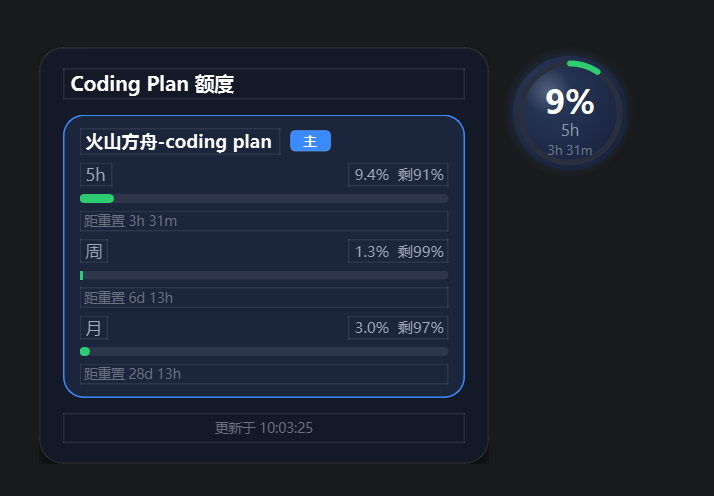

# Coding Plan 桌面悬浮监控

一个常驻桌面角落的小球，帮你看清几家 AI 平台的额度还剩多少。

不用打开网页、不用刷新控制台，瞄一眼桌面就知道：
- 火山方舟 Coding Plan 的 5 小时窗口 / 周 / 月额度用了多少
- MiniMax 的 Coding Plan 剩余多少
- DeepSeek 今天花了多少钱、余额还剩多少
- Qoder 的套餐 + 组织共享池额度用了多少

## 长什么样



- 桌面角落常驻一个小球，环形显示当前额度用了百分之多少，下面写距下次重置还有多久
- 鼠标移到球上，弹出详情卡看各档位明细
- 左键点球：切换看哪个档位（5小时 / 周 / 月）
- 右键点球：进设置、切换平台、立即刷新、退出
- 可以用鼠标拖到任意位置

## 配额超了会怎样

- 用到 80%：球变橙色提醒
- 用到 95%：球变红色告警
- 登录失效 / 拉不到数据：球变灰 + 红色 `!` + 右下角弹通知

## 配置哪家平台（三选一即可，配几个看几个）

下面三家难度不同，按需配置。

---

### ① MiniMax（最简单 ⭐）

只需一个 API key。

1. 打开 [MiniMax 控制台](https://platform.minimaxi.com/console/usage) 登录
2. 找到 API Key 管理，创建一个 Coding Plan 类型的 key（以 `sk-cp-` 开头）
3. 复制这串 key

### ② DeepSeek（简单 ⭐）

只需一个 API key。程序会自动记下每天开始时的余额，算出当天花了多少。

1. 打开 [DeepSeek 控制台](https://platform.deepseek.com/usage) 登录
2. 进入 API keys 页面，创建一个 key（以 `sk-` 开头）
3. 复制这串 key

### ③ 火山方舟 Coding Plan（专用浏览器登录 ⭐⭐）

火山方舟的额度查询接口需要登录态（cookie + csrf_token 等请求头），普通复制粘贴对小白不友好。本程序用和 Qoder 同样的方式：开一个**专属 Chrome 窗口**，你在里面登录一次，之后所有额度查询都直接在这个窗口的页面里调用接口完成（浏览器自动带上全部凭证）。

**前置条件**：电脑里装有 Chrome 或 Edge（Win11 自带 Edge 即可）。

**第 1 步：在设置里添加火山方舟**

1. 启动悬浮球，右键点球 -> 设置...
2. 左下角选 `火山方舟 (volcengine)`，点"添加"

**第 2 步：登录**

1. 在右侧的凭证框下方，点 **"打开火山方舟登录窗口"** 按钮
2. 程序会帮你打开一个 Chrome 窗口，自动跳到 [火山方舟 Coding Plan 额度页](https://console.volcengine.com/ark/region:cn-beijing/subscription/coding-plan)
3. 在这个窗口里完成登录（账号密码 / 扫码都行）
4. 登录成功后无需任何操作：程序几秒内自动检测到登录，登录窗口会自动关闭，设置面板出现 `✓ 登录成功,正在拉取额度数据…`

> 登录态存到程序目录下的 `volcengine_profile/` 文件夹里，登录态约 48 小时有效。

**过期怎么办**：球会变红并提示接口 401。回设置再点一次"打开火山方舟登录窗口"重新登一下即可。

### ④ Qoder（专用浏览器登录 ⭐⭐⭐）

Qoder 没有 API key 机制，额度查询依赖浏览器里的加密登录 cookie（DPAPI 绑定到本地浏览器安装），不能像火山方舟那样手动复制。本程序会启动一个**专属的 Chrome 窗口**去取数据，登录态存在程序目录下的 `qoder_profile/` 文件夹里。

**前置条件**：电脑里装有 Chrome 或 Edge（Win11 自带 Edge 即可）。

**第 1 步：在设置里添加 Qoder**

1. 启动悬浮球，右键点球 -> 设置...
2. 左下角选 `Qoder`，点"添加"

**第 2 步：登录**

1. 在右侧的凭证框下方，点 **"打开 Qoder 登录窗口"** 按钮
2. 程序会帮你打开一个 Chrome 窗口，自动跳到 [Qoder 用量页](https://qoder.com/account/usage)
3. 在这个窗口里完成登录（账号密码 / Google / GitHub 都行）
4. 登录成功后直接关掉这个窗口 —— cookie 已经写到 `qoder_profile/`

**之后**：程序每次轮询都用这个专属 Chrome 在后台取数。cookie 约 8 天有效期内不用再管。

**cookie 过期怎么办**：球会变灰并提示 `Qoder 登录已过期`。回设置再点一次"打开 Qoder 登录窗口"重新登一下即可。

> 注意：登录必须在程序帮你打开的那个 Chrome 窗口里完成，不要顺手在你自己常用的 Chrome 里登 —— 两个 Chrome 是独立的程序读不到那个的 cookie。

---

## 启动方式

### 方式一：下载现成的 exe（推荐，无需装任何东西）

去本项目的 [Releases 页面](../../releases)，下载 `tokenWatch.exe`，双击就能跑。

第一次用：在 exe 同目录放一个 `config.json` 文件写你的配置（可以从仓库的 `config.example.json` 复制改名）。之后程序会记住配置，直接双击 exe 启动即可。

想让它在开机时自动启动：右键 exe -> 创建快捷方式 -> `Win+R` 输入 `shell:startup` 回车 -> 把快捷方式拖进打开的文件夹。

### 方式二：用源码运行（需要懂一点 Python）

需要 Python 3.10 以上。

```bash
pip install -r requirements.txt
python monitor.py
```

## 设置面板说明

右键点球 -> 设置... 打开设置面板：

- **左侧列表**：你配好的所有平台，点哪个编辑哪个，右边显示该平台的填写框
- **添加模型**：左下角选平台类型，点"添加"
- **删除**：每行右边的红色小图标（当前正在显示的那个平台不能删，先切换到别的再删）
- **外观**：切换浅色 / 深色主题（会实时预览，取消则还原）、轮询间隔、预警/告警阈值
- **主 Provider**：球上默认显示哪家
- 保存后立即生效

## 安全提醒

你的配置文件 `config.json` 里是真实登录凭证，**不要发给任何人、不要传到 GitHub**。程序已经设置好忽略这个文件。

如果担心泄露了：
- 火山方舟：回控制台重新登录一次，旧的就失效了；同时删掉程序目录里的 `volcengine_profile/` 文件夹
- MiniMax / DeepSeek：去控制台把 key 删掉重新生成一个
- Qoder：删掉程序目录里的 `qoder_profile/` 文件夹，并在你登录过的 Chrome 里退出登录

## 许可证

MIT —— 自由使用、修改、分享。
